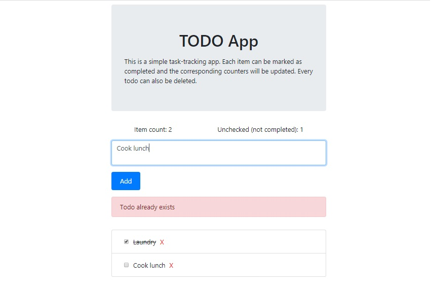

# Todo app

This is a simple task-tracking app. Each item can be marked as completed and the corresponding counters will be updated. Every todo can also be deleted.

## Instructions
In the project directory, run `npm install` to install the necessary modules.
Running `npm start` will launch the app in development mode on [http://localhost:3000](http://localhost:3000).

This project was bootstrapped with [Create React App](https://github.com/facebook/create-react-app).
